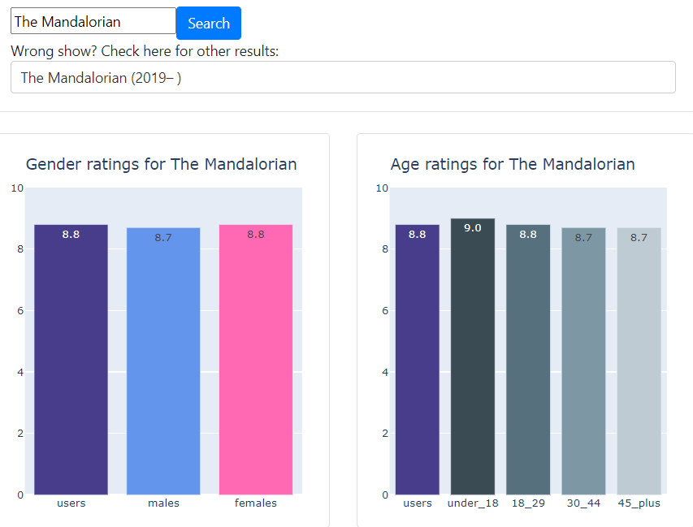

## Developer Portfolio

###[Political GPS](https://christopherbaim.github.io/Political_GPS/)

Political GPS is a program that uses real-time GPS data to display the electoral district you are in and the political party in power. 
Election results and geographic boundary data is stored locally, so no internet connection is required.

Optimized to run on a [Raspberry Pi Zero W](https://www.raspberrypi.org/products/raspberry-pi-zero-w/) with
 [16x2 LCD RGB backlit display](https://www.sparkfun.com/products/10862) and [Adafruit Ultimate GPS module](https://www.adafruit.com/product/746).

  
  *Political GPS Display*

###[Dual Timer](https://christopherbaim.github.io/Dual_Timer/)

Dual Timer is a GUI with keyboard input that allows a user 
to simultaneously record two interaction types and their 
duration over a set period of time.

  

###[IMDb Ratings Visualizer](https://christopherbaim.github.io/IMDb_Visualizer/)

IMDb Visualizer is an interactive dashboard for viewing IMDb tv show ratings broken down by Age and Gender.

Check out the web app on Heroku:

<a href="https://imdb-visualizer.herokuapp.com/">

  

###[Auto Drawer](https://christopherbaim.github.io/AutoDrawer/)

Auto Drawer is a simple freehand drawing tool using mouse automation.
From a source image, it draws a [binary image](https://en.wikipedia.org/wiki/Binary_image)
in applications that allow freehand mouse drawing (ex. Microsoft Paint or [Roll20](https://roll20.net/)).

  

